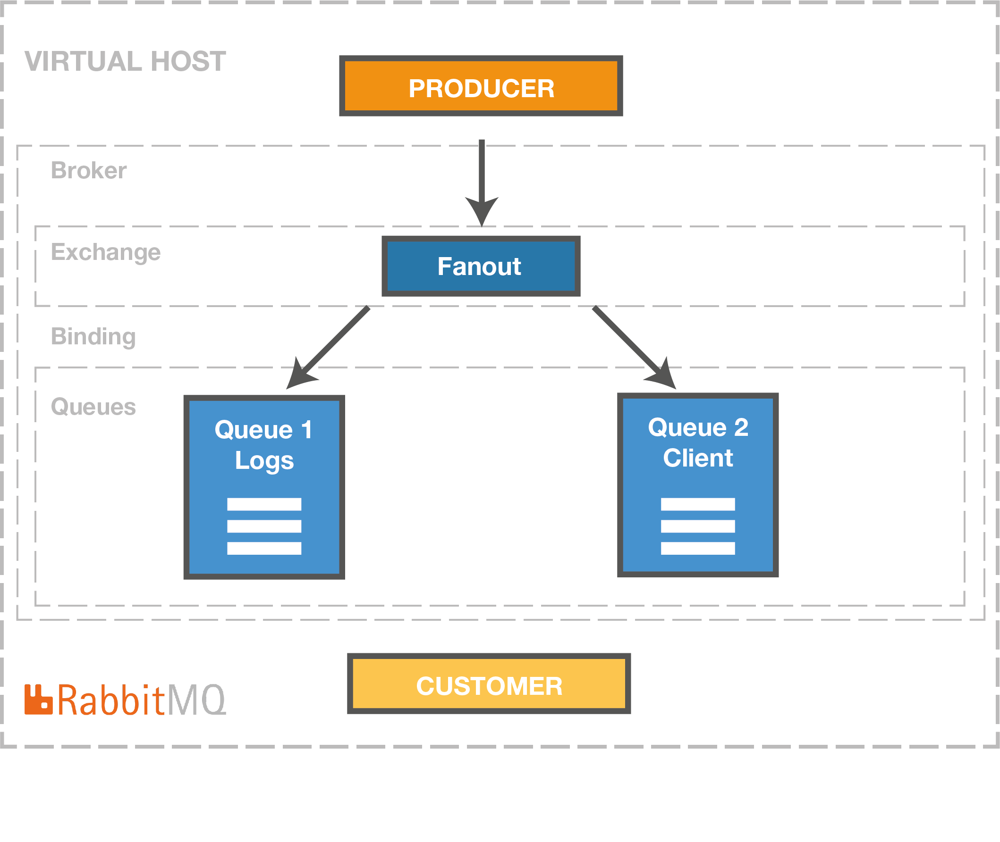

# Development of applications and web services for the IoT 
## Course 1 : Ingestion with RabbitMQ
### Overview
The [deploy_rabbitmq.py](deploy_rabbitmq.py) deploy the follow architecture in rabbitmq.

We use 2 docker compose :

`https://docs.docker.com/samples/library/rabbitmq/`

[docker-compose.yml](docker-compose.yml])

`https://github.com/Senzing/mock-data-generator`

[docker-compose-data.yml](docker-compose-data.yml])

