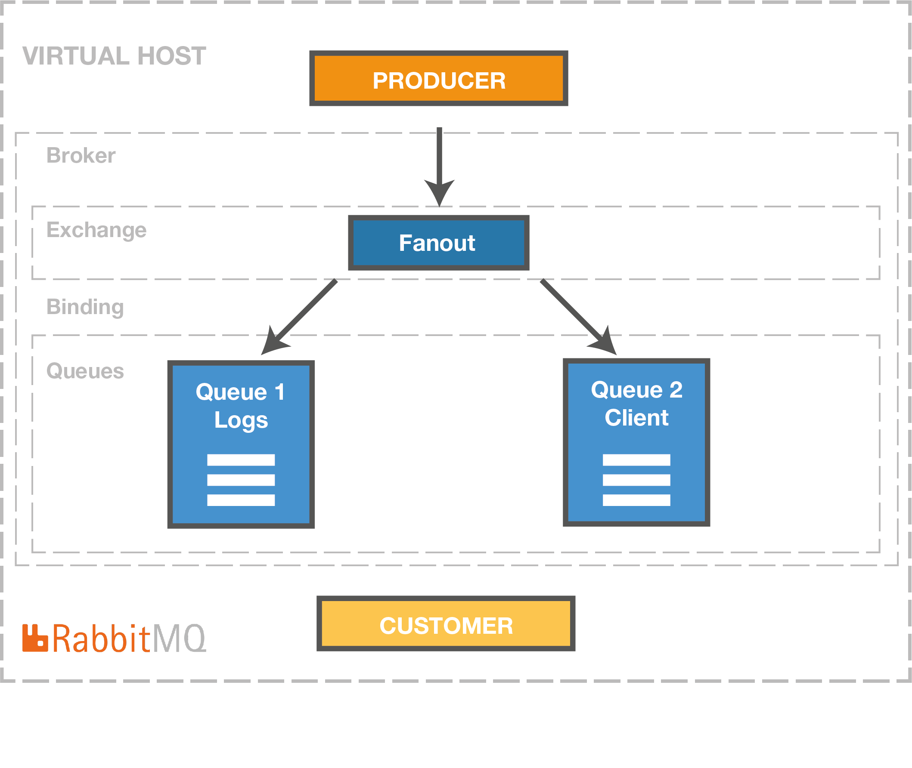

# Development of applications and web services for the IoT 
## Course 1 : Ingestion with RabbitMQ

### Overview
1. Install chronium or another browser
    1. Launch RabbitMQ with docker in a terminal

        `chromium http://localhost:15672/` or http://localhost:15672/

        `docker-compose -f docker-compose.yml up` 

1. In new terminal launch a second mock-data

    `docker-compose -f docker-compose-data.yml up`

1. Check if Python ou Python3 is installed
    1. Create the architecture with a client id with the script and a welcome message in the broker [deploy_rabbitmq.py](deploy_rabbitmq.py)

      `python3 deploy_rabbitmq.py`


1. Stop and reset virtual host with [reset_rabbitmq.py](reset_rabbitmq.py)

    `python3 reset_rabbitmq.py`

### Content
The [deploy_rabbitmq.py](deploy_rabbitmq.py) deploy the follow architecture in rabbitMQ.



We use 2 docker compose :

`https://docs.docker.com/samples/library/rabbitmq/`

[docker-compose.yml](docker-compose.yml)
```
version: '3.7'
services:

  rabbitmq1:
    image: "rabbitmq:3-management"
    hostname: "rabbitmq1"
    environment:
      RABBITMQ_ERLANG_COOKIE: "SWQOKODSQALRPCLNMEQG"
      RABBITMQ_DEFAULT_USER: "rabbitmq"
      RABBITMQ_DEFAULT_PASS: "rabbitmq"
      RABBITMQ_DEFAULT_VHOST: "/"
    ports:
      - "5672:5672"
      - "15672:15672"    
    networks:
      - iot-labs
    labels:
      NAME: "rabbitmq1"

networks:
  iot-labs:
    external: true
```

`https://github.com/Senzing/mock-data-generator`

[docker-compose-data.yml](docker-compose-data.yml)
``` version: '3.7'
services:

  moke1:
    image: "pcourbin/mock-data-generator:latest"
    hostname: "moke1"
    environment:
      SENZING_SUBCOMMAND: random-to-rabbitmq
      SENZING_RANDOM_SEED: 1
      SENZING_RECORD_MIN: 1
      SENZING_RECORD_MAX: 100
      SENZING_RECORDS_PER_SECOND: 1
      SENZING_RABBITMQ_HOST: rabbitmq1
      SENZING_RABBITMQ_PASSWORD: rabbitmq
      SENZING_RABBITMQ_USERNAME: rabbitmq
      SENZING_RABBITMQ_QUEUE: client1
      MIN_VALUE: 500
      MAX_VALUE: 700
      SENZING_DATA_TEMPLATE: '{"SENSOR":"Temp1","DATE":"date_now", "VALUE":"float"}'
    tty: true
    labels:
      NAME: "moke1"
    networks:
      - iot-labs


networks:
  iot-labs:
    external: true
```


### Others Python script

[send_message.py](send_message.py)

[receive.py](receive.py)

[send.py](send.py)


